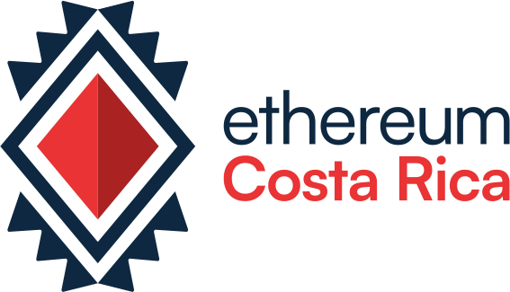

[](https://t.me/EthereumCR) [-black?style=for-the-badge&logo=X>)](https://twitter.com/EthereumCR) [](https://www.instagram.com/ethereumcr/) [](https://www.linkedin.com/company/ethereum-costa-rica/)    

## Ethereum Costa Rica

This is the official website of Ethereum Costa Rica that aims to strengthen the dissemination and exchange of knowledge about Ethereum and Blockchain in Costa Rica.

## Description

Welcome to the digital heart of the Ethereum Costa Rica community. This website is the gateway to a universe of knowledge, collaboration and exciting events related to Ethereum and blockchain technology.

Highlighting community engagement, the web project reflects Ethereum Costa Rica's mission to share knowledge, foster creativity, and promote the adoption of decentralized technologies. Additionally, it serves as the digital epicenter for the highly anticipated annual event, Ethereum Costa Rica Day, offering details on programming, featured speakers, and how to participate.

## Getting Started

This is a [Next.js](https://nextjs.org/) project bootstrapped with [`create-next-app`](https://github.com/vercel/next.js/tree/canary/packages/create-next-app).

First, run the development server:

```bash
npm run dev
# or
yarn dev
# or
pnpm dev
```

Open [http://localhost:3000](http://localhost:3000) with your browser to see the result.

You can start editing the page by modifying `pages/index.tsx`. The page auto-updates as you edit the file.

[API routes](https://nextjs.org/docs/api-routes/introduction) can be accessed on [http://localhost:3000/api/hello](http://localhost:3000/api/hello). This endpoint can be edited in `pages/api/hello.ts`.

The `pages/api` directory is mapped to `/api/*`. Files in this directory are treated as [API routes](https://nextjs.org/docs/api-routes/introduction) instead of React pages.

This project uses [`next/font`](https://nextjs.org/docs/basic-features/font-optimization) to automatically optimize and load Inter, a custom Google Font.

## Learn More

To learn more about Next.js, take a look at the following resources:

- [Next.js Documentation](https://nextjs.org/docs) - learn about Next.js features and API.
- [Learn Next.js](https://nextjs.org/learn) - an interactive Next.js tutorial.

You can check out [the Next.js GitHub repository](https://github.com/vercel/next.js/) - your feedback and contributions are welcome!

## Deploy on Vercel

The easiest way to deploy your Next.js app is to use the [Vercel Platform](https://vercel.com/new?utm_medium=default-template&filter=next.js&utm_source=create-next-app&utm_campaign=create-next-app-readme) from the creators of Next.js.

Check out our [Next.js deployment documentation](https://nextjs.org/docs/deployment) for more details.

## How to contribute to the project

**1.** The first step is to `fork` the repository.
**2.** The second step is to `clone` the repository that you already forked.
**3.** Then you can create a `branch` to do your work.
**4.** You can now make changes and `commit` them.
**5.** When you are done make sure to `push` the changes to Github.
**6.** Create a `pull request`.
**7.** Sync your `forked master branch`.
**8.** And finally, delete the unnecessary `branch`.

## License

This project is licensed under the [MIT](https://github.com/Ethereum-Costa-Rica/ethereum.cr/blob/main/LICENSE) license.

## Contributors ✨

<table>
  <tbody>
    <tr>
      <td align="center" valign="top" width="14.28%"><a href="https://github.com/aguzmant103"><br /><sub><b>aguzmant103 </b></sub></a><br /></td>
      <td align="center" valign="top" width="14.28%"><a href="https://github.com/JustinCast"><br /><sub><b>JustinCast </b></sub></a><br /></td>
      <td align="center" valign="top" width="14.28%"><a href="https://github.com/Coderoostr"><br /><sub><b>Coderoostr </b></sub></a><br /></td>
      <td align="center" valign="top" width="14.28%"><a href="https://github.com/brolag"><br /><sub><b>brolag </b></sub></a><br /></td>
    </tr>
  </tbody>
</table>
